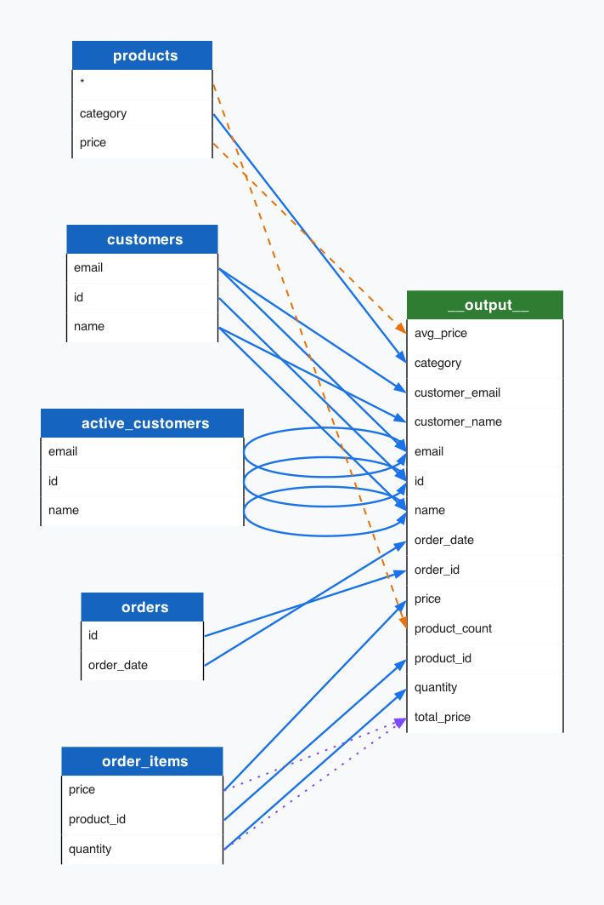

# trino-lineage

Column-level lineage extraction for Trino SQL. Parse Trino SQL files, extract column-level lineage via sqlglot AST analysis, and render graph visuals.

## Features

- Column-level lineage tracing -- resolve every column from source to target through CTEs, subqueries, JOINs, aggregations, and window functions
- Deep nested SQL support -- handles unlimited CTE nesting, UNION, SELECT *, aliases, and complex expressions
- Professional graph rendering (Graphviz) -- box-style diagrams with color-coded table nodes
- REST API -- POST SQL and receive JSON lineage with optional DOT/PNG graph output
- CLI tool -- `trino-lineage parse file.sql --output-dir ./out`
- Multiple output formats -- JSON lineage report, DOT file, PNG rendering

## Quick Start

```bash
pip install trino-lineage

# CLI: parse a SQL file
trino-lineage parse query.sql --output-dir ./lineage_output

# API: start server
trino-lineage serve
```

## Architecture

```
SQL File  -->  SQL Parser  -->  Lineage Engine  -->  Graphviz Renderer
(Trino)       (sqlglot)                           -->  JSON Lineage
                                                    -->  DOT + PNG
```

## Output Format

### JSON Lineage

```json
{
  "lineage": [
    {
      "target": { "table": "analytics.orders_agg", "column": "total_revenue" },
      "sources": [
        { "table": "raw.orders", "column": "quantity", "relation": "through_expression" },
        { "table": "raw.orders", "column": "price", "relation": "through_expression" }
      ],
      "transformation": "expression",
      "expression": "SUM(o.quantity * o.price)",
      "confidence": 1.0
    }
  ],
  "tables": {
    "sources": { "raw.orders": ["quantity", "price"] },
    "targets": { "analytics.orders_agg": ["total_revenue"] }
  },
  "metadata": {
    "statements_parsed": 1,
    "edges_count": 5,
    "tables_count": 2,
    "processing_time_ms": 0.53
  }
}
```

### Graph Output

Below is an example rendered PNG from a multi-table SQL query with JOINs, CTEs, and aggregations:



The generated graph uses box-style nodes with rounded corners, color-coded table headers (source/target/intermediate), and clean arrow routing between column ports.

## API Endpoints

| Method | Path               | Description                            |
|--------|--------------------|----------------------------------------|
| POST   | `/lineage`         | Submit SQL text, get lineage + graph   |
| POST   | `/lineage/files`   | Upload SQL file(s) for analysis        |
| GET    | `/health`          | Health check                           |

## Why trino-lineage?

- Trino-native -- uses the Trino dialect for maximum SQL compatibility
- Deep tracing -- resolves columns through unlimited CTE nesting and subquery depth
- Production-grade -- built for real-world data pipelines with complex SQL
- Dual interface -- CLI for batch jobs, API for integration
